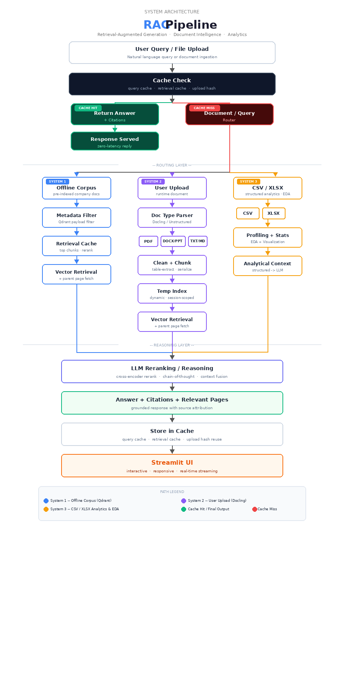

# ✨ Hybrid Document Intelligence RAG System

### 🧠 System-1 vs System-2 Hybrid Retrieval Architecture  

A production-oriented Retrieval Augmented Generation (RAG) platform designed for *large-scale financial document intelligence and general document reasoning*, combining fast cached retrieval (System-1) with deep reasoning retrieval and reranking (System-2).

The system enables scalable question answering over *bulk-ingested corporate reports as well as real-time user document uploads*, while maintaining citation grounding, structured analytics capability, evaluation readiness and modular extensibility.

---

## 🧠 Architecture Overview

  

---

## 🚀 Core Capabilities

* Hybrid Retrieval Architecture (*System-1 Cache + System-2 Deep Reasoning*)  
* Metadata Filtering & Semantic Routing using *Qdrant Vector DB*  
* Offline Bulk Financial Document Ingestion Pipeline  
* Real-time User Upload Processing & Dynamic Indexing  
* Multiformat Support (*PDF, DOCX, PPT, CSV, TXT, Markdown, HTML*)  
* Advanced Table Serialization for *LLM Numerical Reasoning*  
* Redis Cache for *Low-Latency Response Optimization*  
* Hybrid Retrieval (*Vector + BM25 + Parent Page Retrieval*)  
* LLM Reranking for Context Precision  
* CSV Analytics Engine with Visualization (*Matplotlib / Seaborn*)  
* Multimodal Ready Pipeline (*Scanned PDFs / Images Supported*)  
* MCP Integration Ready (*Claude Tool Calling Architecture*)  
* Voice Interaction Support (*Whisper Speech-to-Text + ElevenLabs Text-to-Speech*)  
* Evaluation Framework Integration (*RAGAS Precision / Recall / Faithfulness*)  

---

## ⚙️ System Design Philosophy

This platform follows a cognitive architecture inspired design:

| Layer | Role |
|------|------|
| *System-1* | Low latency cached retrieval for previously answered queries |
| *System-2* | Deep reasoning retrieval with reranking and context refinement |
| *Routing Layer* | Detects entity / intent and selects optimal retrieval path |
| *Analytics Layer* | Structured reasoning for tabular datasets |
| *Reasoning Layer* | Final grounded answer synthesis |

This hybrid approach balances *speed, reasoning depth and scalability*.

---

## 🔄 End-to-End Pipeline Flow

1. Offline ingestion converts financial PDFs into structured knowledge representations.  
2. Tables are serialized to preserve row-column semantics.  
3. Embeddings and metadata indexes are stored in Qdrant.  
4. User query is received through Streamlit UI.  
5. Router detects company/entity keywords and selects retrieval path.  
6. Uploaded documents are dynamically processed via Unstructured / Docling pipelines.  
7. Hybrid retrieval fetches relevant context using vector search + BM25 + metadata filtering.  
8. Parent page retrieval ensures contextual grounding.  
9. Cross-encoder reranking improves chunk relevance.  
10. LLM performs reasoning on compressed context window.  
11. RAGAS evaluation metrics compute precision / faithfulness signals.  
12. Final grounded answer with citations and page references is returned and cached.

---

## 📊 Tabular Analytics Engine

The system includes an embedded structured analytics workflow:

* Automated exploratory data profiling  
* Statistical summaries and anomaly detection  
* Visualization via Matplotlib / Seaborn  
* LLM-assisted tabular reasoning  
* Fusion of numeric insights with textual evidence  

---

## ⚡ Performance Optimization Strategy

* Query-level caching for near-zero latency repeat responses  
* Conditional reranking to reduce LLM compute cost  
* Metadata filtering to shrink retrieval search space  
* Parent page retrieval to reduce hallucination risk  
* Session-scoped temporary indexing for uploaded files  
* Parallel retrieval execution for throughput improvement  

---

## 📚 Citation Grounding & Explainability

Each generated response includes:

* Source document reference  
* Page index grounding  
* Evidence chunk attribution  

This ensures *auditability, transparency and trustworthiness*, critical for financial document intelligence systems.

---

## 🧩 Tool-Calling & Agentic Readiness

The architecture is designed to integrate with:

* MCP tool ecosystems  
* External knowledge connectors  
* Autonomous retrieval agents  
* Multi-step reasoning workflows  

---

## 🧱 Production-Ready Engineering Practices

* Modular ingestion / retrieval / reasoning architecture  
* Configurable pipeline orchestration  
* Parallel retrieval and reranking execution  
* Evaluation-friendly structured output schema  
* Extensible vector database abstraction  

---

## 🖥 Demo

* Interactive Streamlit Question Answering Interface  
* End-to-end working demo video available  

---

⭐ If you found this project interesting, consider starring the repository.
