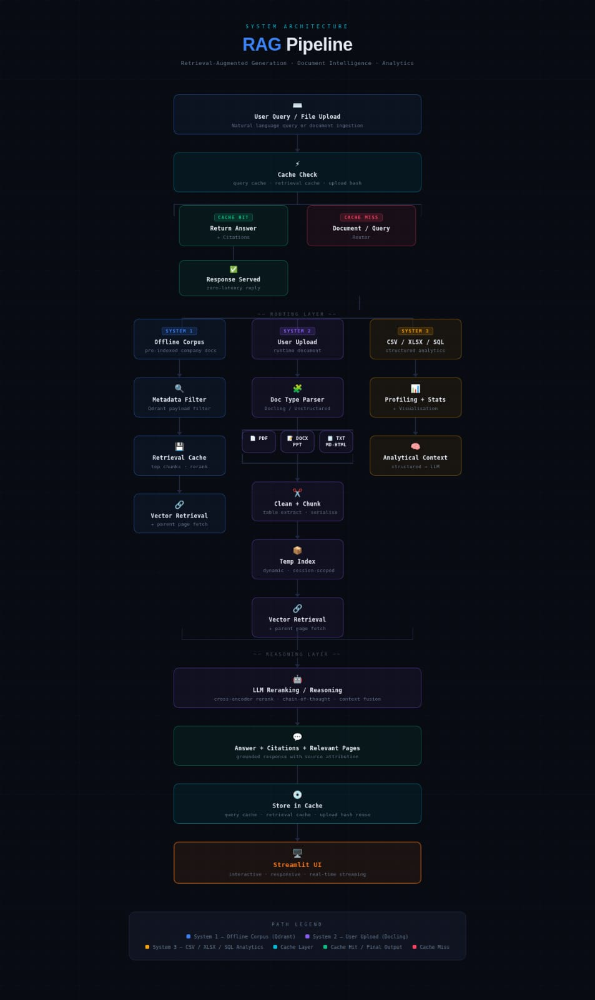

# ✨ Financial Multimodal RAG System

### System-1 vs System-2 Hybrid Retrieval Architecture

A production-oriented Retrieval Augmented Generation (RAG) platform designed for **large-scale financial document intelligence**, combining fast cached retrieval (System-1) with deep reasoning retrieval and reranking (System-2).

The system enables scalable question answering over **bulk-ingested corporate reports as well as real-time user document uploads**, while maintaining citation grounding, structured analytics capability and modular extensibility.

---

## 🧠 Architecture Overview

---

## 🚀 Core Capabilities

* Hybrid **System-1 (fast cached retrieval)** and **System-2 (deep reasoning retrieval + reranking)** pipeline
* Supports **PDF, DOCX, PPT, CSV, TXT, Markdown, HTML**
* Multimodal ingestion ready (scanned PDFs supported via Docling / Unstructured pipeline)
* Financial reasoning with **page-level citations and grounded answers**
* Intelligent query routing between **offline corpus and user uploads**
* Metadata-aware vector retrieval using **Qdrant**
* Integrated **tabular analytics and visualization pipeline**
* Cache-first latency optimization design
* Modular architecture designed for **agentic extensions and tool-calling workflows**

---

## ⚙️ System Design Philosophy

This platform follows a cognitive architecture inspired design:

| Layer               | Role                                                         |
| ------------------- | ------------------------------------------------------------ |
| **System-1**        | Low latency cached retrieval for previously answered queries |
| **System-2**        | Context refinement, reranking and deep reasoning             |
| **Routing Layer**   | Detects query intent and selects optimal retrieval path      |
| **Analytics Layer** | Structured reasoning for tabular datasets                    |
| **Reasoning Layer** | Final answer synthesis with citation grounding               |

This hybrid approach balances **speed, accuracy and scalability**.

---

## 🔄 End-to-End Pipeline Flow

1. Offline ingestion converts financial PDFs into structured knowledge representations.
2. Tables are serialized and preserved to improve reasoning accuracy.
3. Vector embeddings and metadata indexes are stored in Qdrant.
4. User query is received via Streamlit interface.
5. Routing detects company/entity keywords and selects retrieval strategy.
6. Uploaded documents are parsed dynamically using Unstructured ingestion pipeline.
7. Hybrid retrieval fetches relevant context (vector + metadata filtering).
8. Cross-encoder reranking improves chunk relevance.
9. LLM performs reasoning on compressed context window.
10. Final grounded answer is returned with citations and relevant page references.

---

## 📊 Tabular Analytics Engine

The system includes an embedded structured analytics workflow:

* Automated exploratory data profiling
* Statistical summaries and pattern detection
* Visualization support via Matplotlib / Seaborn
* LLM-assisted tabular reasoning
* Context fusion between numeric insights and textual evidence

---

## ⚡ Performance Optimization Strategy

* Query-level caching for near-zero latency repeat responses
* Conditional reranking to minimize LLM compute cost
* Metadata filtering to reduce vector search space
* Parent page retrieval to reduce hallucination risk
* Session-scoped temporary indexing for user uploads
* Modular ingestion enabling incremental corpus expansion

---

## 📚 Citation Grounding & Explainability

Each generated response includes:

* Source document reference
* Page index grounding
* Evidence chunk attribution

This ensures **auditability, transparency and trustworthiness**, which is critical for financial intelligence applications.

---

## 🧩 Tool-Calling & Agentic Readiness

The architecture is designed to integrate seamlessly with:

* MCP tool ecosystems
* External knowledge connectors
* Autonomous retrieval agents
* Multi-step reasoning workflows

---

## 🧱 Production-Ready Engineering Practices

* Modular ingestion / retrieval / reasoning layers
* Configurable pipeline orchestration
* Parallel retrieval capability
* Evaluation-friendly output schema
* Extensible vector database abstraction

---

## 🎯 Future Enhancements

* Full multimodal VLM reasoning integration
* Adaptive semantic chunking strategies
* Automated metadata extraction during ingestion
* Latency-aware retrieval planner
* Distributed vector search deployment
* Multi-agent orchestration layer

---

## 🖥 Demo

* Interactive Streamlit QA interface
* End-to-end working demo video available

---

⭐ If you found this project interesting, consider starring the repository.
